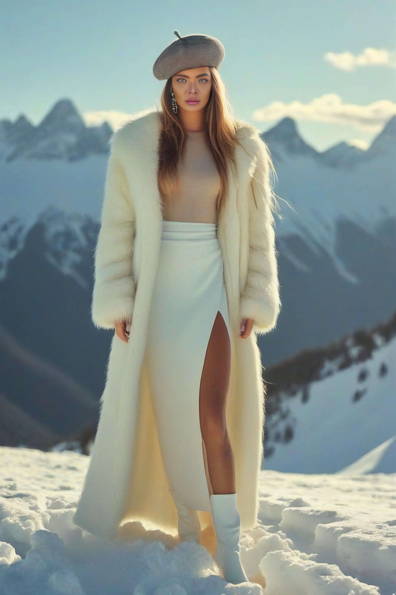
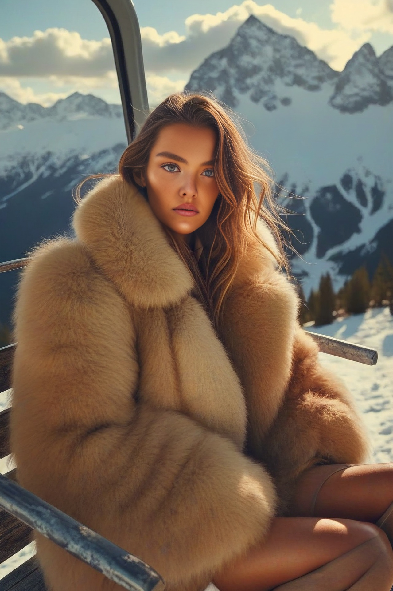
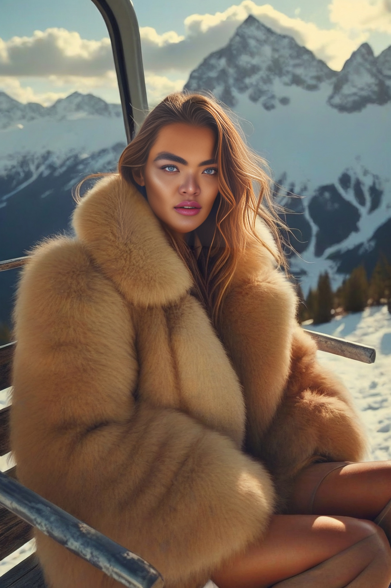
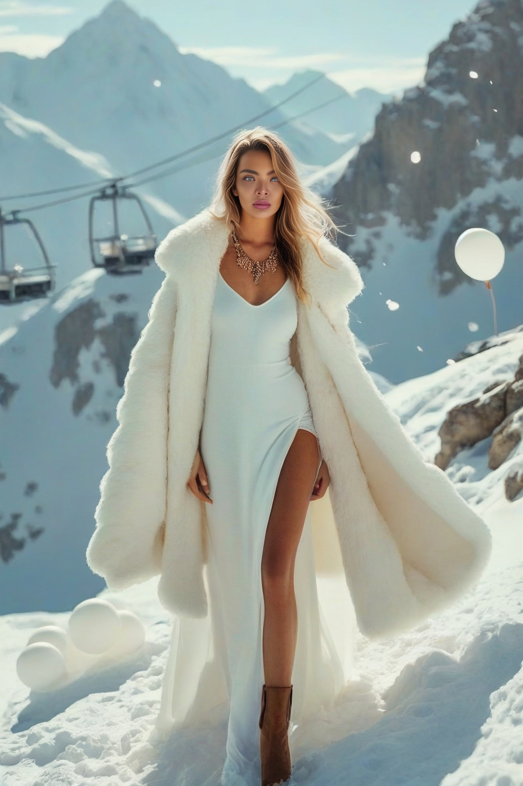

# FACE SWAP
# WHAT WE USE?
- [INSIGHFACE](https://github.com/deepinsight/insightface)
- [DIFFUSERS](https://huggingface.co/docs/diffusers/index)
- [CONTROLER_AUX](https://github.com/huggingface/controlnet_aux)
- [IP-Adapter: Text Compatible Image Prompt Adapter for Text-to-Image Diffusion Models](https://github.com/tencent-ailab/IP-Adapter)
- [GFPGAN](https://github.com/TencentARC/GFPGAN)


# Архитектура модели

Архитектура модели представляет собой последовательное взаимодействие нескольких компонентов, каждый из которых выполняет конкретную задачу в процессе генерации изображения. Below приведено описание шаг за шагом:

---

## 1. **Анализ лица**
   - **Библиотека:** `insightface`
   - **Модель:** `buffalo_l`
   - **Описание:** 
     - Из исходного изображения (`path_source`) извлекаются данные о лице, включая:
       - landmarks лица.
       - embedding лица.
     - То же самое выполняется для целевого изображения (`path_target`).

---

## 2. **Создание маски лица**
   - **Описание:** 
     - На основе кепок лица создается бинарная маска, где область лица заполнена белым цветом.
     - Маска используется для определения области, которая будет заменена при инпейтинге.

---

## 3. **Подготовка контрольных изображений**
   - **Описание:** 
     - Из целевого изображения генерируются контрольные изображения:
       - Обнаружение контуров тела (OpenPose).
       - Обработка краев (Canny).
     - Эти изображения помогают сохранять позу и контуры тела при генерации нового изображения.

---

## 4. **Выравнивание лиц**
   - **Описание:** 
     - Выравнивание лица из исходного изображения с лицом из целевого изображения.
     - Используется аффинное преобразование для соответствия позы и ориентации лиц.

---

## 5. **Генерация изображения**
   - **Библиотека:** `DIFFUSERS`
   - **Модель:** `StableDiffusionInpaintPipeline`
   - **IP-ADATER** 'IPAdapterFaceIDPlus'
   - **Описание:** 
     - Используется для замены области лица в целевом изображении на выровненное лицо из исходного изображения.
     - Учитываются контрольные изображения и маска для сохранения контуров и позы.
     - Параметры:
       - Промпт: "Generate a highly realistic face swap with the reference face seamlessly integrated into the target image. The result should be photorealistic"
       - Негативный промпт: "Do not include any visible artifacts, such as plastic-like skin, fish-eye effects, or unrealistic textures"
       - Количество шагов диффузии: 40
       - Семя: 20232

---

## 6. **Восстановление изображения**
   - **Библиотека:** `GFPGAN`
   - **Модель:** `GFPGANv1.4`
   - **Описание:** 
     - Улучшение качества полученного изображения.
     - Устранение артефактов и повышение резкости.
     - Параметры:
       - Увеличение: 2x
       - Архитектура: clean
       - Умножитель каналов: 2


## Installation

```
#CREATE ENV CONDA

conda create --name sd-faceswap

#install req
conda activate sd-faceswap
pip install -r requirements.txt

usage: main.py [-h] --source SOURCE --target TARGET --output OUTPUT
```

## RESULT

| Target Image  | Result Image  |
|---------------------------------------------|---------------------------------------------|
|  |  |
|  |  |
|  |  |
